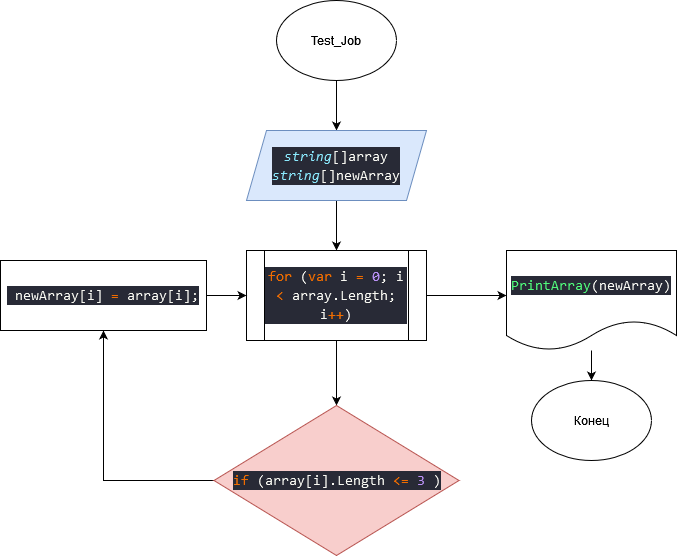

# test_job
---
Написать программу, которая из имеющегося массива строк формирует массив из строк, длина которых меньше либо равна 3 символа. Первоначальный массив можно ввести с клавиатуры,  либо задать на старте выполнения алгоритма. При решении не рекомендуется пользоваться коллекциями, лучше обойтись исключительно массивами.
1. Объявляю два массива. Первый с уже заполненными строками и второй такой же длины в который будут добавляться строки, длина которых будет меньше либо равнам 3 символам.
2. Создаю метод для заполнение второго массива и поэлементно с помощью оператора "for" проверяю, чтобы каждый элемент соответствовал условию "if (array[i].Length <= 3 )". Если элемент первого массива удовлетворяет условию, то записываем этот эелемент во второй массив с помощью команды "newArray[i] = array[i];".
4. Блок схема алгоритма.
